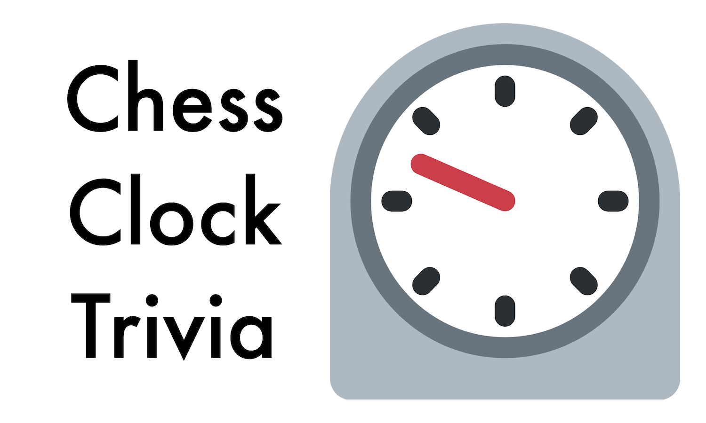

Chess Clock Trivia is a trivia game where contestants answer questions within a certain time limit.

## Installation
This guide assumes that you have the following installed
- Python 3.8

### Installing Redis
From [redis.io](https://redis.io/):
> Redis is an open source (BSD licensed), in-memory data structure store, used as a database, cache, and message broker. Redis provides data structures such as strings, hashes, lists, sets, sorted sets with range queries, bitmaps, hyperloglogs, geospatial indexes, and streams.

In Chess Clock Trivia, Redis is used to sync sessions between servers. Thus to make Chess Clock Trivia run you need to install Redis.

(**Note**: This section is oriented towards installation on Mac OSX or Linux. If you are using Windows, there is a [fork](https://github.com/MicrosoftArchive/redis) of Redis that can be installed on Windows. However, its use on Windows may be finicky.)

1. Download the Redis source code by going [here](https://redis.io/download) and downloading either the **Stable** release. You should get a file called `redis-stable.tar.gz`.
2. Now switch over to root and extract Redis' source code to `/usr/local/lib/`:
```bash
sudo su root
mkdir -p /usr/local/lib/
chmod a+w /usr/local/lib/
tar -C /usr/local/lib/ -xzf redis-stable.tar.gz
```
3. (Optional) You can now remove the original `redis-stable.tar.gz` file by doing
```bash
rm redis-stable.tar.gz
```
4. Now navigate into the `redis-stable` directory in `/usr/local/bin` and run the `make` command:
```bash
cd /usr/local/lib/redis-stable/
make && make install
```
5. (Optional but advised) You should test the Redis installation by running
```bash
make test
```
6. Check that your Redis installation is working by running the commands below.
```
redis-cli --version
redis-server --version
```

### Installing Dependencies
1. Download the whole repository as a `.zip` file. You can do so by clicking [this link](https://github.com/Ryan-Kan/Chess-Clock-Trivia/archive/refs/heads/main.zip).
2. Extract the contents of that `.zip` file.
3. Navigate to the root directory of Chess Clock Trivia:
    ```bash
    cd PATH/TO/ROOT/DIRECTORY
    ```
4. **(Optional)** You may choose to use a virtual environment to install the dependencies of Chess Clock Trivia.
    * On Ubuntu/Linux, before creating the virtual environment, you may need to run:
        ```bash
        sudo apt-get install python3-venv
        ```
    * Create a virtual environment (`venv`) using the following command:
        ```bash
        python3 -m venv venv --prompt NAME_OF_VIRTUAL_ENV
        ```
5. Install all dependencies of Chess Clock Trivia by running:
    ```bash
    pip3 install -r requirements.txt
    ```

## Credits and Licenses
Open [this document](data/credits.md) to see the full list of credits and licenses.
