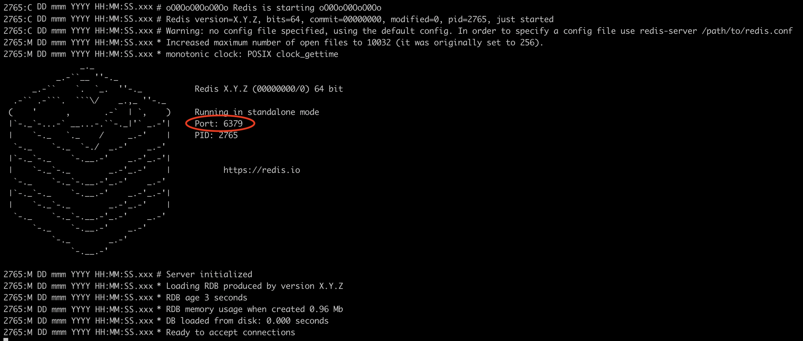

Chess Clock Trivia is a trivia game where teams answer questions within a certain time limit.

## Installation
This guide assumes that you have the following installed:
- Python 3.8

### Installing Redis
From [redis.io](https://redis.io/):
> Redis is an open source (BSD licensed), in-memory data structure store, used as a database, cache, and message 
  broker. Redis provides data structures such as strings, hashes, lists, sets, sorted sets with range queries, bitmaps,
  hyperloglogs, geospatial indexes, and streams. Redis has built-in replication, Lua scripting, LRU eviction, 
  transactions, and different levels of on-disk persistence, and provides high availability via Redis Sentinel and 
  automatic partitioning with Redis Cluster.

In Chess Clock Trivia, Redis is used to sync sessions between servers. Thus, to make Chess Clock Trivia run you need 
to install Redis.

(**Note**: This section is oriented towards installation on Mac OSX or Linux. If you are using Windows, there is a 
[fork](https://github.com/MicrosoftArchive/redis) of Redis that can be installed on Windows. However, its use on 
Windows may be finicky.)

1. Download the Redis source code by going [here](https://redis.io/download) and downloading either the **Stable** 
   release. You should get a file called `redis-stable.tar.gz`.
2. Now switch over to root and extract Redis' source code to `/usr/local/lib/`:
   ```shell
   sudo su root
   mkdir -p /usr/local/lib/
   chmod a+w /usr/local/lib/
   tar -C /usr/local/lib/ -xzf redis-stable.tar.gz
   ```
3. (Optional) You can now remove the original `redis-stable.tar.gz` file by doing
   ```shell
   rm redis-stable.tar.gz
   ```
4. Now navigate into the `redis-stable` directory in `/usr/local/bin` and run the `make` command:
   ```shell
   cd /usr/local/lib/redis-stable/
   make && make install
   ```
5. (Optional but advised) You should test the Redis installation by running
   ```shell
   make test
   ```
6. Check that your Redis installation is working by running the commands below.
   ```
   redis-cli --version
   redis-server --version
   ```

### Installing Dependencies
1. Download the whole repository as a `.zip` file. You can do so by clicking 
   [this link](https://github.com/Ryan-Kan/Chess-Clock-Trivia/archive/refs/heads/main.zip).
2. Extract the contents of that `.zip` file.
3. Navigate to the root directory of Chess Clock Trivia:
    ```shell
    cd PATH/TO/ROOT/DIRECTORY
    ```
4. **(Optional)** You may choose to use a virtual environment to install the dependencies of Chess Clock Trivia.
    * On Ubuntu/Linux, before creating the virtual environment, you may need to run:
        ```shell
        sudo apt-get install python3-venv
        ```
    * Create a virtual environment (`venv`) using the following command:
        ```shell
        python3 -m venv venv --prompt NAME_OF_VIRTUAL_ENV
        ```
5. Install all dependencies of Chess Clock Trivia by running:
    ```shell
    pip3 install -r requirements.txt
    ```

## Running The Server
The Chess Clock Trivia server can be started by following these steps (note: this assumes that you have followed the 
steps above and installed Chess Clock Trivia).

1. Navigate to the root directory of Chess Clock Trivia:
   ```shell
   cd PATH/TO/ROOT/DIRECTORY
   ```
2. Start the redis server by running:
   ```shell
   redis-server
   ```
3. Upon running the redis server you should get an image like this:
   
   Take note of the port (circled in red) that is generated. In the above image the port is `6379`, but the port may 
   differ from machine to machine.
4. Create the environment variable `REDIS_URL` by running
   ```shell
   export REDIS_URL="redis://localhost:YOUR_PORT_HERE/" 
   ```
   where `YOUR_PORT_HERE` is replaced with the port generated in step 3.
5. Start the Chess Clock Trivia server by running:
   ```shell
   gunicorn wsgi:app
   ```

Sometimes, an error like `ConnectionError: Cannot connect to redis server. Has the redis server been started yet?` may
be shown. In this case, check if the redis server has been started, or check if you have entered the correct port for
the `REDIS_URL`.

## Rules and Protocols
The rules and protocols for Chess Clock Trivia can be obtained [here](static/resources/pdf/rules.pdf) as a PDF file.

## Credits and Licenses
Open [this document](data/credits.md) to see the full list of credits and licenses.
